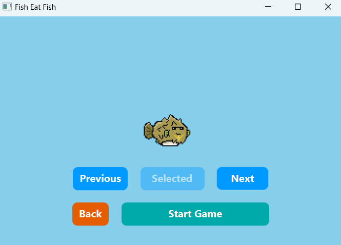
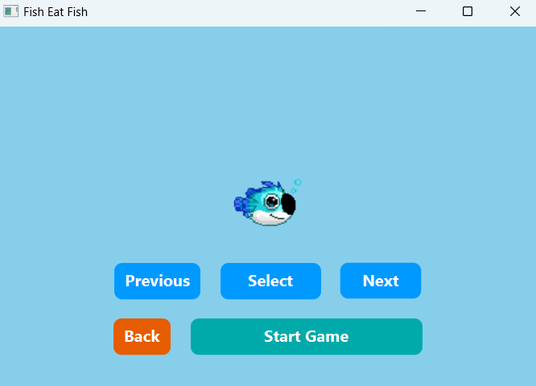

# Fish Eat Fish Game

Fish Eat Fish is an interactive, GUI-based game developed in Java. Players control a fish that must grow by consuming smaller fish while avoiding being eaten by larger ones.

It was developed as a group assignment for University of Malaya's Fundamentals of Programming course.

## initialization

Please follow this tutorial: https://youtu.be/4IYLf3siEuc

## key features

- Authentication System
- diverse fish designs
- multiple playable fish
- Character movement using wasd
- Balanced scoring system
- Viewable Game History
- Competitive Leaderboard

## Technology Stack

The game is built using the following technologies:

- Java – Core programming language
- JavaFX – GUI framework for building interactive user interfaces

## Game Snapshots

## How to play

1. Start the game by logging in or signing up.
2. Select your fish from the available choices.
3. Navigate the waters using the WASD keys.
4. Eat smaller fish to grow in size and earn points.
5. Avoid larger fish, or you'll lose the game!
6. Compete for the highest score and track your progress in the leaderboard.
